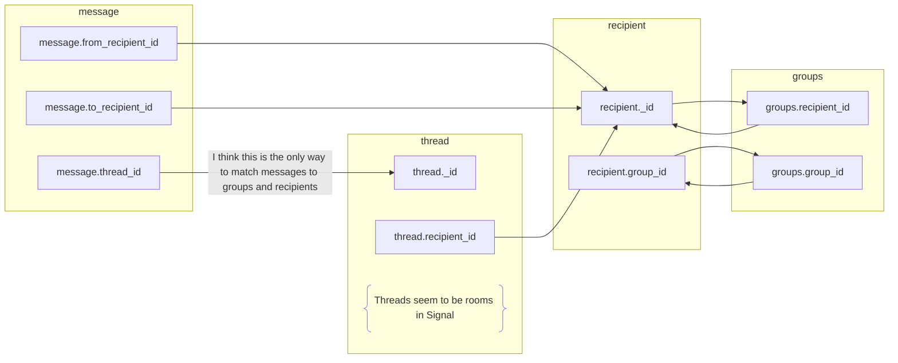

```mermaid
flowchart LR
    A --> D
    B --> D
    D --> F
    F --> D
    E --> G
    G --> E
    C --> |I think this is the only way to match messages to groups and recipients| H
    I --> D

    subgraph message
    A[message.from_recipient_id]
    B[message.to_recipient_id]
    C[message.thread_id]
    end
    subgraph recipient
    D[recipient._id]
    E[recipient.group_id]
    end
    subgraph groups
    F[groups.recipient_id]
    G[groups.group_id]
    end
    subgraph thread
    H[thread._id]
    I[thread.recipient_id]
    J@{ shape: braces, label: "Threads seem to be rooms in Signal" }
    end
```